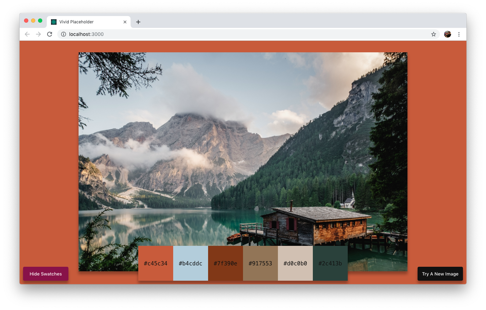

# 📷 vivid-placeholder

A simple React app that takes an image and finds its top 6 colors to change the body background and offer the colors as swatches.

Uses [react-color-extractor](https://www.npmjs.com/package/react-color-extractor) for the extraction. Also uses the [Unsplash Source API](https://source.unsplash.com/) to get a random picture.

This was a research idea to see how this could work in practice. The app is client-side since there is not need to a server to parse or store the images.
